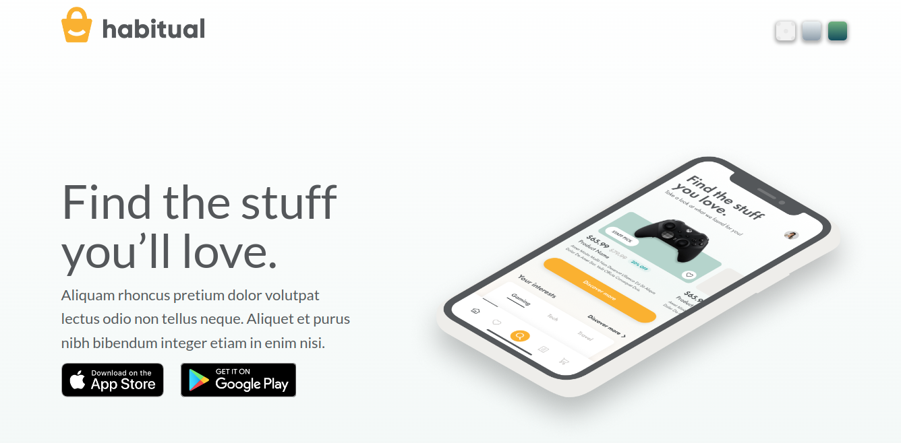

# basicJS_Figma_Splash Page: [LIVE DEMO](https://shcoobz.github.io/basicJS_figma_splash-page/)

## Summary

basicJS_Splash Page provides a visually engaging splash page for showcasing applications. It features a clean, user-friendly interface inspired by a professional design created in Figma, emphasizing ease of navigation and aesthetic appeal.

The core functionality includes:

- Dynamic background changes to enhance user interaction and visual appeal.
- Links to app stores, facilitating easy downloads of the showcased app.
- Responsive design that adapts to various screen sizes and devices.

## Features

### Dynamic Background Toggle

Users can change the background of the splash page with simple clicks, showcasing different styles and providing a dynamic visual experience.

### App Store Links

Direct links to both Apple's App Store and Google Play are provided, allowing users to download the showcased app directly, enhancing user conversion.

### Responsive Design

Ensures that the splash page looks great on both mobile and desktop devices, adapting layout and content to fit various screen resolutions and orientations.

### Integration with Figma Designs

The page design was developed based on high-fidelity mockups created in Figma, ensuring that the final product closely matches the envisioned design.

## Technologies

- HTML/CSS: For structuring and styling the web page.
- JavaScript: Used to handle dynamic interactions such as background switching.
- Figma: The initial design and mockups were created in Figma, ensuring a high level of design fidelity and user experience.

---

_Note: This document provides an overview of basicJS_Splash Page. For detailed instructions and more information, please refer to the source code documentation._

_This project has been enhanced and converted into a React-based application, which can be viewed [here](https://github.com/Shcoobz/advancedJS_figma_splash-page). The React version integrates more advanced state management and component-based architecture for improved maintainability and scalability._
